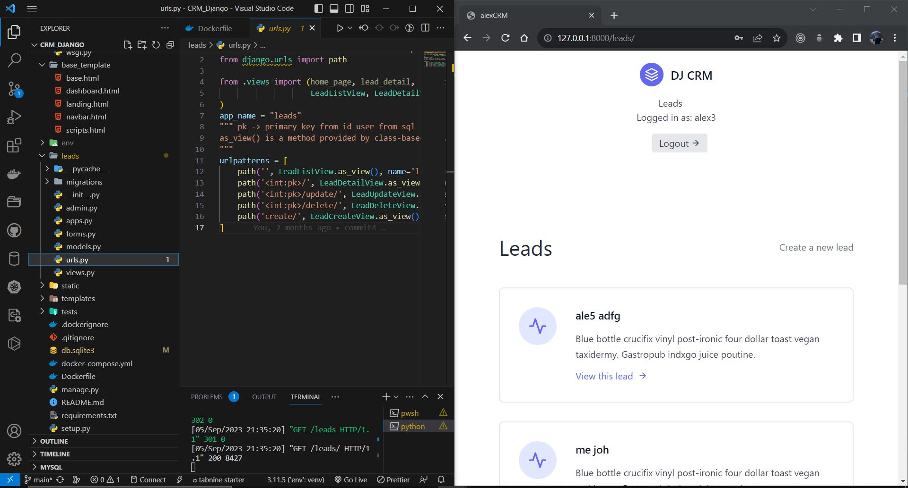
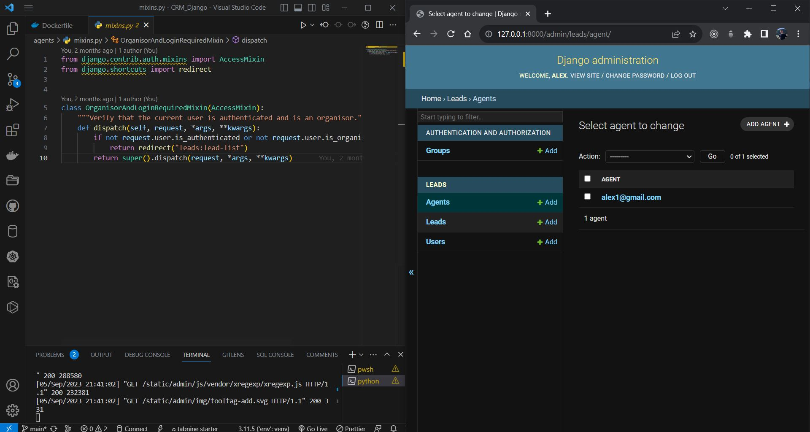

# CRM with Django-Framework

A CRM system gathers, links, and analyzes all collected customer data, including contact information, interactions with company representatives, purchases, service requests, assets, and quotes/proposals. The system then lets users access that data and understand what happened at each touchpoint.

## Installation packages

 Create a vitual enviroment for this project: python -m venv //name of venv// and after you must to install next packages for this project.

- asgiref==3.7.2 -> ASGI is a standard for Python asynchronous web apps and servers to communicate with each other, and positioned as an asynchronous successor to WSGI.
- Django==4.2.3 -> Django is a high-level Python web framework that encourages rapid development and clean, pragmatic design.
- sqlparse==0.4.4 -> sqlparse is a non-validating SQL parser for Python. It provides support for parsing, splitting and formatting SQL statements.
- tzdata==2023.3 -> This is a Python package containing zic-compiled binaries for the IANA time zone database.
- pytz==2023.03 -> pytz - World Timezone Definitions for Python
And also we have another packages for installation like: certifi==2023.5.7, charset-normalizer==3.1.0,  django-cors-headers==4.1.0, djangorestframework==3.14.0, idna==3.4, and other.

Output all dependences in one file: requirements.txt and you can install all packages typing code in the terminal: pip install requirements.txt

## Starting a Project
### Create project with django -> django-admin startproject alexaCRM
In this folder will install default structure of files like _ _init_ _.py, settings.py and others and __manage.py__ which is a command-line utility that lets you interact with this Django project in various ways. In this project folder most important file is __settings.py__ where find secret key, define variables, config., templates and database, if create apps we add in INSTALLS_APPS

### Start run the server -> python manage.py runserver
The server run on development server at http://127.0.1:8000
You can also migrate any changes in project and upload data in sqlite3 file create in project directory -> __python manage.py migrate__

### Create app for leads management -> python manage.py startapp leads
In this app folder will find :
- migrations (changes of database)
- init.py (making leads module as well)
- admin.py (django-admin)
- apps.py (conf leads folder to be recognise as a app)
- module.py (define app's data models using Django's (ORM) system.)
- tests.py (test code)
- views.py (handle requests and returning responses of html file)

Add the name of app ,,leads'' in settings.py/INSTALLED_APPS
After create in model file User, Agent and Lead, make migration and the output will be 0001_initial.py, in this file will be all provided fields by django and data which create in models.py file in leads app. We make migrate on database and generate db whit leas_user, leads_agent, leas_user_group whit all data upload in tables.

### Query sets and managers
I use python shell but before this a create a super user -> python mangae.py createsuperuser and set email and password. With python shell  with import from leads.models Lead,i create user 
- >>>from django.contrib.auth import get_user_model
- >>>User = get.user_model()
- >>>User.objects.all() => data in sql
In python shell i create leads, users and admin-user and managment with all data i use django-admin (localhost/admin), login with username and password. We can add sections, groups of data with create function from django packages with admin.site.register(User, Lead and Agent).

### Create first view of leads
In leads/views.py i create function home_page with request and render (shortcut from sjango), return HTTPResponse and after insert urlpattern in url.py and import home_page from leads.views. After this setup we can run server and chec the message response from def function home_page.

### Create templates for views
I creat templates folder whit all pages need for this project and evrey path file i insert in setting.py/TEMPLATES/[BASE_DIR] for detecte by django.
After that i create templates with html file for all pages for details of leads, user and agents. For this i use Tailwind -> a CSS framework that provides us with single-purpose utility classes which are opinionated for the most part.
## Test_Cases

Test cases, also known as unit tests, are a fundamental aspect of software testing. They are designed to verify that individual units or components of a software application, such as functions, methods, or classes, behave correctly and produce the expected output for given inputs.

In the context of Django or any other testing framework, a test case is a Python class that inherits from a testing base class, such as django.test.TestCase, unittest.TestCase, or any custom test case class. Test cases contain methods, known as test methods, that perform various checks and assertions to validate the behavior of the code being tested.

### test_view.py

In this file i create two Django test cases, SignupViewTest and LandingPageViewTest, each testing the behavior of their respective views for GET requests.

- SignupViewTest:
This test case is testing a view responsible for user signup. It includes two test methods: test_signup_view_get and test_signup_view_post.

test_signup_view_get:
This test method tests the behavior of the signup view when a GET request is made. It ensures that the view returns a 200 (OK) status code, uses the 'registration/signup.html' template, and includes an instance of CustomUserCreationForm in the response context.

test_signup_view_post:
This test method tests the behavior of the signup view when a POST request is made with form data. It verifies that the view redirects to the 'login' URL (status code 302) after successful signup and that the user is created in the database.

- LandingPageViewTest:
This test case is testing a view that renders the landing page of the website. It contains one test method: test_landing_page_view.

test_landing_page_view:
This test method tests the behavior of the landing page view when a GET request is made. It ensures that the view returns a 200 (OK) status code and uses the 'landing.html' template.

## Docker_file
Dockerization is the process of packaging an application and its dependencies into a container, using Docker, a popular containerization platform. The main goal of Dockerization is to create a portable and reproducible environment that allows the application to run consistently across different systems, such as development, testing, staging, and production environments.
Run in terminal the following command to start the project: docker compose up --build, and open Docker Desktop for acces the link of server (8000:8000)

#### Fig.1 Lead list

#### Fig.2 Create Lead

#### Fig.3 Add Lead to the Agent group
